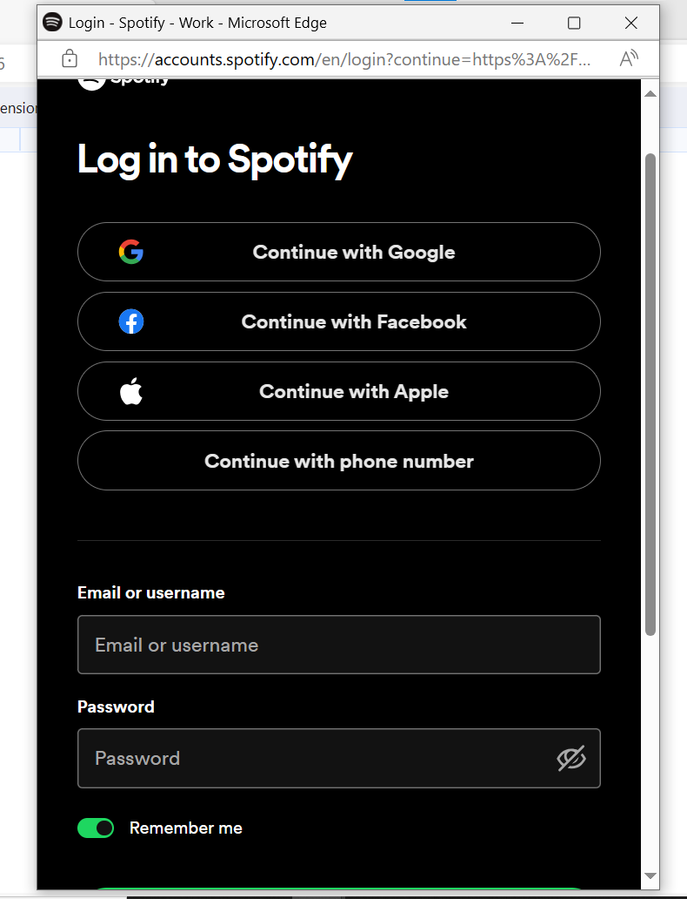
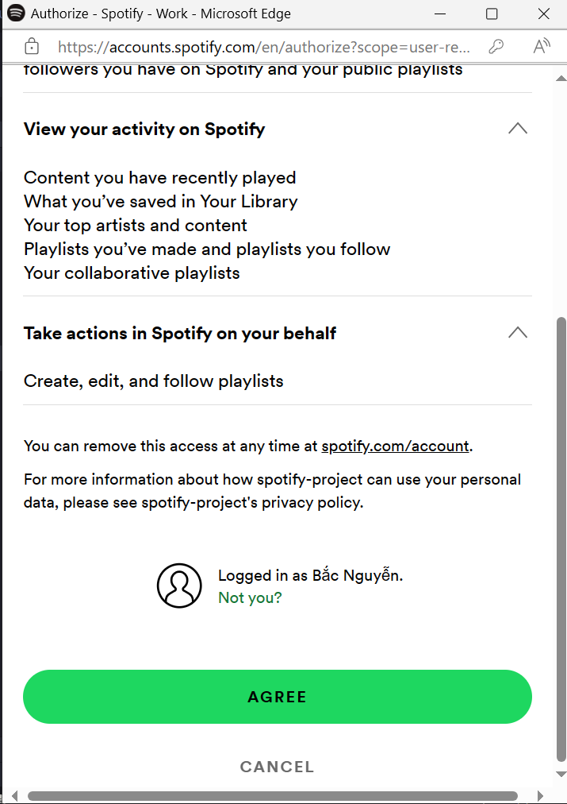

# React-Native-Spotify

# 💻 Công nghệ và công cụ sử dụng
   	  
# Cách sử dụng chương trình
- Chạy chương trình với npm run web
- Chương trình sẽ hiển thị vào màn hình Login

- Người dùng nhấn vào nút Sign in with Spotify, chuyển đến mà hình xác nhận người dùng

  
-Sau khi xác nhận tài khoản và mật khẩu người dùng chọn tiếp tục

Chọn AGREE sau đó sử dụng chương trình

